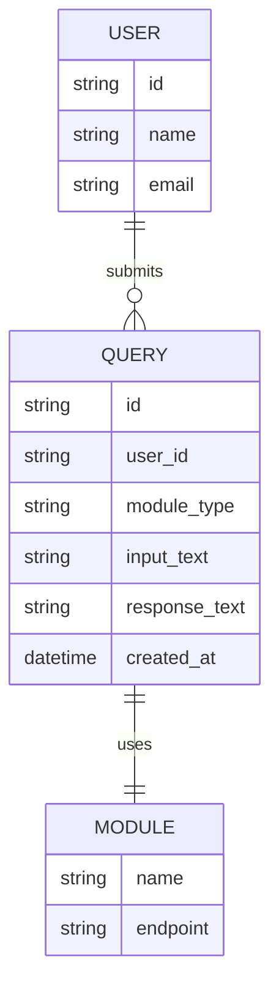

# 3. Project Design Phase

## Technical Architecture

```mermaid
flowchart TD
    A([Start: User opens EduGenie]) --> B[Frontend: User Input]
    B --> C[FastAPI Backend: Based on the user's selection, route to the respective endpoint]
    C --> D[Explanation Module\n(/explain endpoint)]
    C --> E[Q&A Module\n(/qa endpoint)]
    C --> F[Quiz Generation Module\n(/quiz endpoint)]
    C --> G[Summarization Module\n(/summarize endpoint)]
    C --> H[Learning Path Module\n(/learn/recommendations endpoint)]
    D --> I[Frontend: Display Results]
    E --> I
    F --> I
    G --> I
    H --> I
    I --> J([End: Results shown, user interacts again])
```

## Component Overview
- **Frontend (HTML + CSS + JS):** Single-page interface. The learner picks a module
  (Explain / Q&A / Quiz / Summarize / Learning Path), submits input, and the result is
  rendered inline.
- **FastAPI Backend:** Exposes one REST endpoint per module. Each endpoint validates the
  request (Pydantic schema), builds a prompt, and calls the shared Gemini client.
- **Gemini Client:** A single wrapper (`modules/gemini_client.py`) around the
  `google-generativeai` SDK, configured once from the `GOOGLE_API_KEY` environment variable.
  All five modules reuse this client so the Gemini integration lives in one place.

## ER Diagram (data model for future persistence)
EduGenie's MVP is stateless (no database writes), but the model below shows how a future
version could persist learner activity.



## API Design
| Endpoint | Method | Purpose |
|----------|--------|---------|
| `/explain` | POST | Simplified concept explanation |
| `/qa` | POST | Question answering |
| `/quiz` | POST | Multiple-choice quiz generation |
| `/summarize` | POST | Text summarization |
| `/learn/recommendations` | POST | Personalized learning roadmap |
| `/health` | GET | Service health check |
